# Rock Paper Scissors !

This is a simple website that allows users to play the classic game of Rock-Paper-Scissors against the computer. The user selects their move (rock, paper, or scissors) and the computer generates a random move. The winner is determined according to the standard rules of the game.

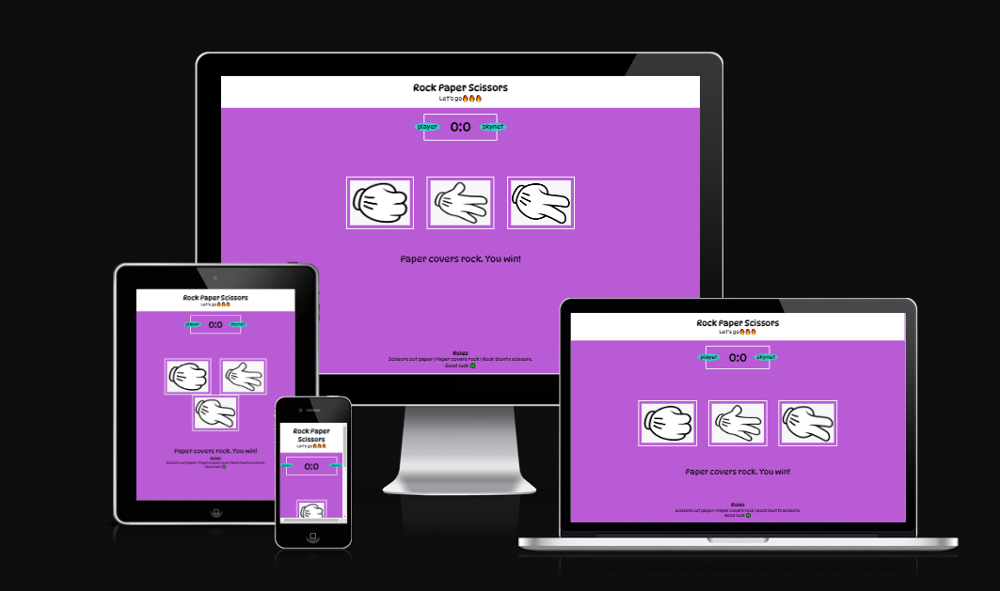

# Table of contents

1. [Getting Started](#started)
2. [User Experience (UX)](#ux)
3. [Features](#features)
4. [Footer](#footer)
5. [Features Left To Implement](#implement)
6. [Testing](#testing)
7. [Deployment](#deployment)
8. [Credits](#credits)

# Getting Started

To view the website, simply click on the following link: [View the live project here](https://rockypraxe.github.io/Rock-Paper-Scissors/)

# User Experience (UX)

## Site Goals
- Provide a fun and engaging way for users to play the classic game of Rock-Paper-Scissors.
- Create a simple and intuitive user interface that is easy to use for players of all ages and skill levels.
- Implement an algorithm for generating random moves by the computer that is fair and unbiased.
- Host the website on a stable and reliable platform (GitHub Pages) that can handle high traffic volumes.

## User Stories
- As a user, I want to be able to select my move (rock, paper, or scissors) quickly and easily so that I can focus on the game.
- As a user, I want to receive clear feedback after each round of the game so that I can understand who won and why.
- As a user, I want to be able to play multiple rounds of the game in a row without having to reload the page so that I can keep playing without interruption.
- As a user, I want to feel like I am playing against a fair and unbiased opponent (the computer) so that I can trust the outcome of the game.
- As a user, I want to be able to see my overall win/loss record against the computer so that I can track my progress over time.
- As a user, I want to be able to easily share the website with my friends so that we can play against each other remotely.
- As a user, I want the website to load quickly and be responsive so that I can start playing right away and not have to wait for the page to load.

# Features

- Player Move Selection: Users can select their move (rock, paper, or scissors) by clicking on one of the three buttons on the screen.
- Computer Move Generation: The computer generates a random move (rock, paper, or scissors) using a fair and unbiased algorithm.
- Round Outcome Determination: The winner of each round is determined according to the standard rules of Rock-Paper-Scissors, and the result is displayed on the screen.
- Score Keeping: The user's win/loss record against the computer is tracked and displayed on the screen.
- Multiple Rounds: Users can play multiple rounds in a row without having to reload the page.
- Responsive Design: The website is designed to be responsive and works well on a variety of screen sizes, from desktop to mobile.
- Shareable URL: Users can easily share the website with friends by copying and pasting the URL into an email or instant message.
- Alerts: Users are presented with alert windows when they click on the player, skynet or the rules.

# Footer

- The footer section includes the rules and "Rules" is also confirm alert.

# Features Left To Implement

- Multiplayer Mode: Implement a feature that allows users to play against each other online, either by sharing a unique game code or by connecting to a central server.
- Customizable Themes: Add the ability for users to choose from different visual themes or customize the background and graphics to their liking.
- Leaderboard: Create a leaderboard that tracks the top players based on win/loss records or other metrics, allowing users to compete with others for a spot at the top.
- Language Support: Add support for multiple languages, allowing users from around the world to enjoy the game in their native language.
- Social Sharing: Enable users to share their win/loss records or gameplay highlights on social media platforms, helping to spread the word about the website and increase its popularity.

# Testing

-  The Website was tested on Google Chrome, Internet Explorer, Microsoft Edge and Safari browsers.
The website was viewed on a variety of devices such as Desktop, Laptop, iPhone7, iPhone 8 & iPhoneX.
-  A large amount of testing was done to ensure that all pages were linking correctly.
-  Friends and family members were asked to review the site and documentation to point out any bugs and/or user experience issues.

- The W3C Markup Validator and W3C CSS Validator Services were used to validate every page of the project to ensure there were no syntax errors in the project.

-  [W3C Markup Validator - Results for index.html](https://validator.w3.org/nu/?doc=https%3A%2F%2Frockypraxe.github.io%2FRock-Paper-Scissors%2F)

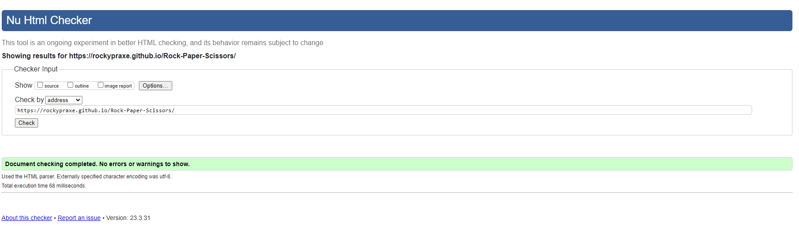

-  [W3C CSS Validator - Results for index.html](https://jigsaw.w3.org/css-validator/validator?uri=https%3A%2F%2Frockypraxe.github.io%2FRock-Paper-Scissors%2F&profile=css3svg&usermedium=all&warning=1&vextwarning=&lang=en)

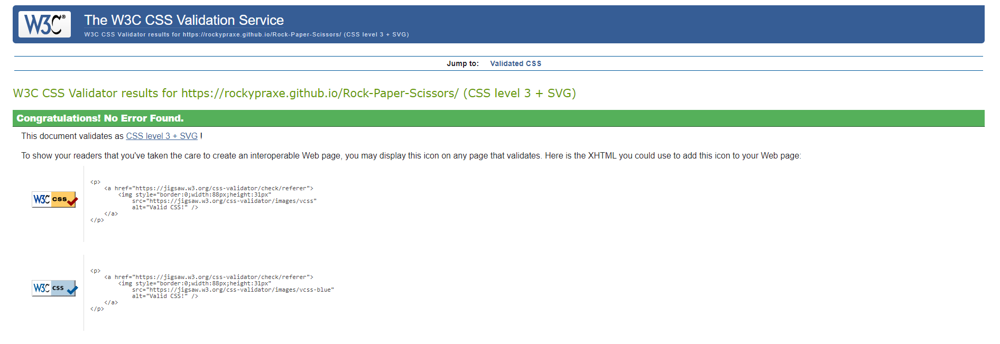

## JavaScript JSHint

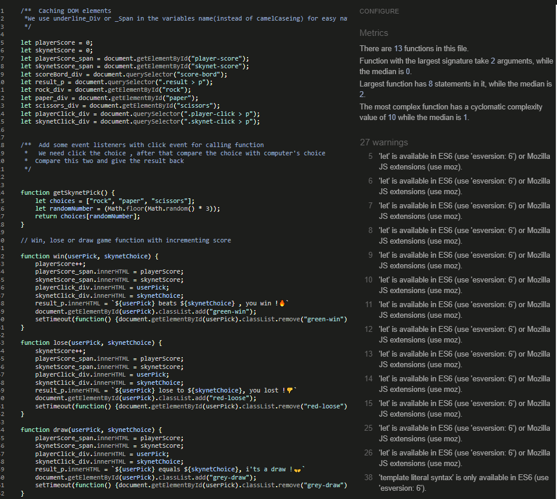

- Lighthouse testing for the desktop version and the mobile version was also improved.

- Desktop Version

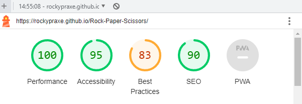

- Mobile version

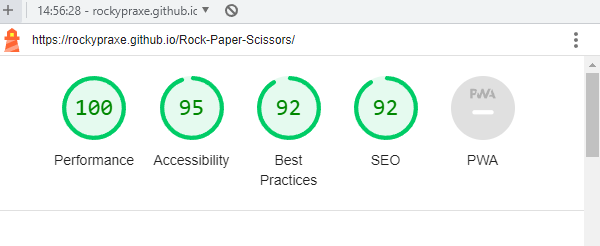

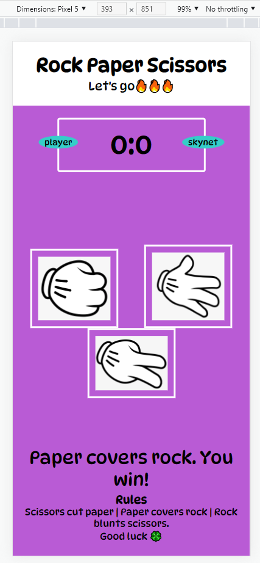
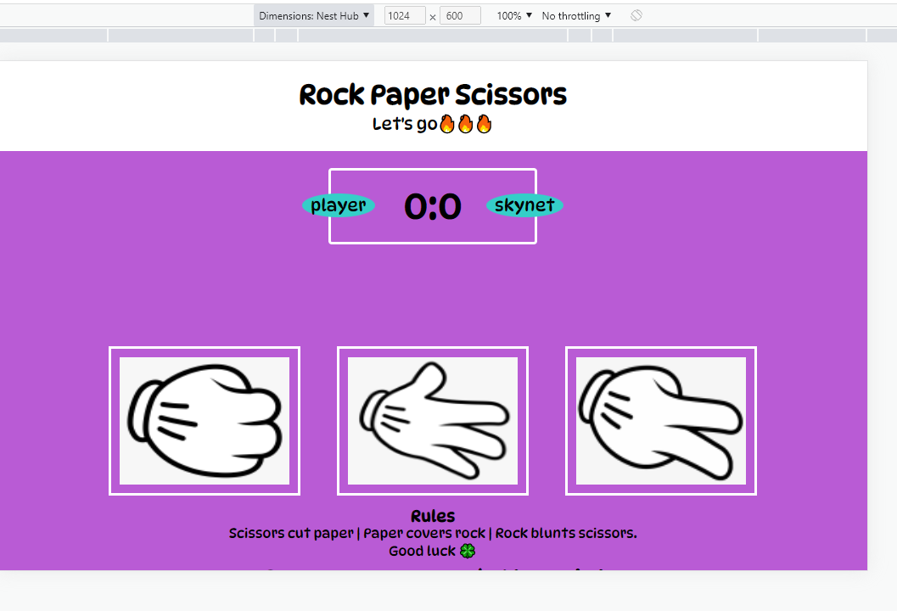
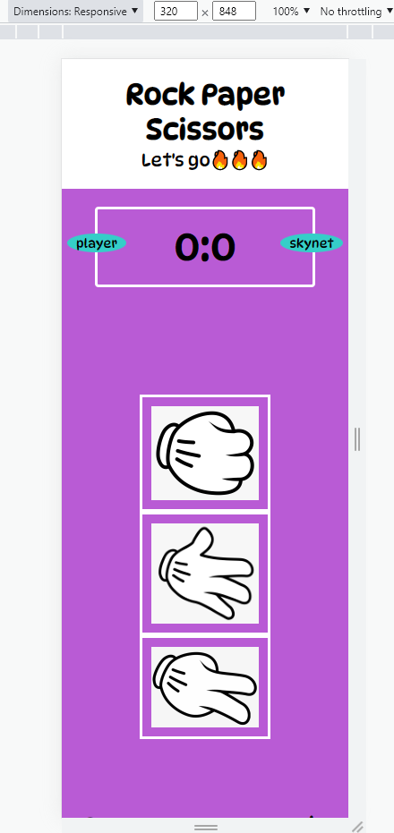

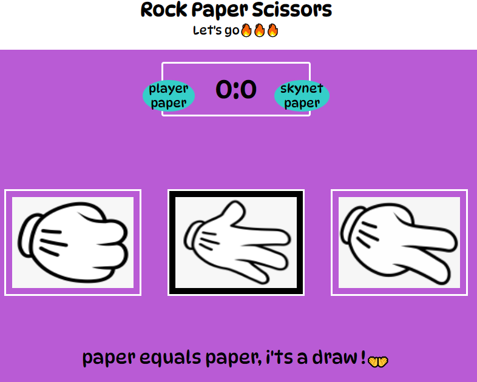
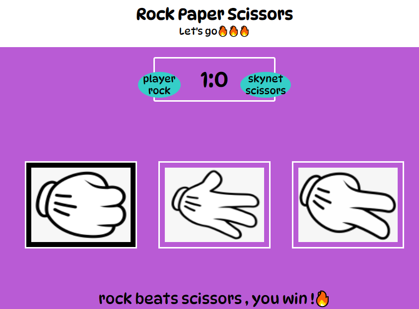
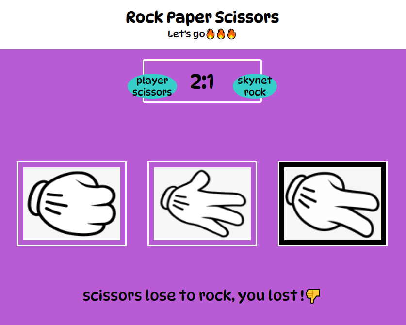

# Deployment

- The site was deployed to GitHub pages. The steps to deploy are as follows:
- In the GitHub repository, navigate to the Settings tab.
-  Then on the left side of the screen click on Pages
- From the source section drop-down menu, select the Master Branch.
- Once the master branch has been selected as main, the page will be automatically refreshed with a detailed ribbon display to indicate the successful deployment.
- The live link can be found here - https://rockypraxe.github.io/Rock-Paper-Scissors/
- Alternatively you can Clone or Fork this repository into your GitHub account.
